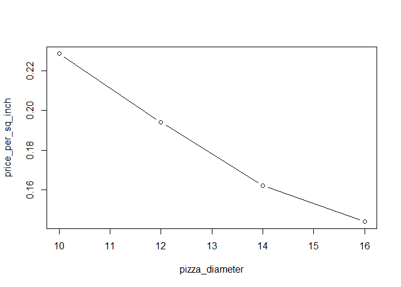

# Literate Calculation
Xiangyi Xu (Lydia)  
Monday, February 02, 2015  

Summary
---------
For pizza lovers, Goat Hill's special combination pizza is very delicious. To get the most for every slice, we will calculate the cost per sqaure inch for each size of pizza. 

Introduction
---------------
Here is detailed information about special combination pizza:

|Size        |Inches  |Price   | 
|------------|:------:|:------:|
|Small       |10"     |$17.95  |
|Medium      |12"     |$21.95  |
|Large       |14"     |$24.95  |
|Extra Large |16"     |$28.95  |

Body
------
An equation for the area of a pizza is:
$$
A = \pi r^2
$$
The diameter of each size pizza is:


```r
d_small   <- 10
d_medium  <- 12
d_large   <- 14
d_exlarge <- 16
```

The price of each size pizza is:


```r
p_small   <- 17.95
p_medium  <- 21.95
p_large   <- 24.95
p_exlarge <- 28.95
```

For the small pizza, d=10 inches:


```r
Area <- function(diameter){
  pi * (diameter/2)^2
}
```

This gives us an area of 78.54 square inches.


```r
A_small <- Area(d_small)
```

Therefore, the cost per square inch for small size of pizza is
$0.23


```r
V_small <- p_small/A_small
```

And the medium pizza is:
$0.19
The large pizza is:
$0.16
The extra large pizza is:
$0.14

As we can see from the graph that, the bigger size the pizza, the cheaper the price is. 


```r
pizza_diameter <- c(small=10, medium=12, large=14, exlarge=16)
pizza_price <- c(small=17.95, medium=21.95, large=24.95, exlarge=28.95)
pizza_area <- Area(pizza_diameter)
price_per_sq_inch <- pizza_price/pizza_area
plot(pizza_diameter, price_per_sq_inch, type="b")
```

 

Conclusion
------------
Through calculation, we can tell that the extra large pizza is the best deal among the four sizes of pizza. 
